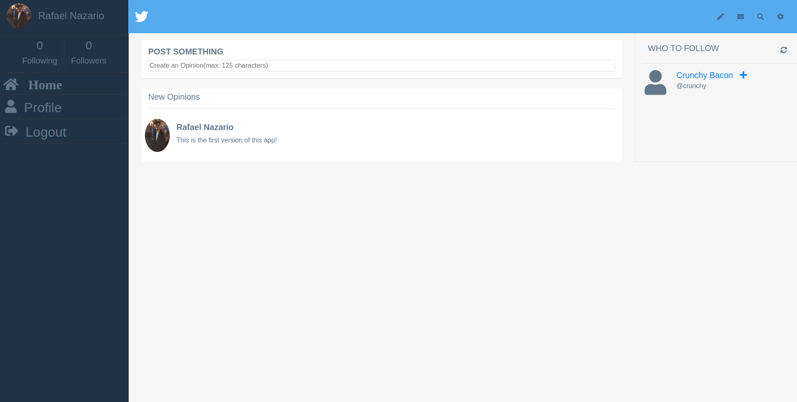

# Capstone Ruby-on-Rails Twitter Redesign
> A social media app in which you can post your thoughts about general topics




<br>The main point of this project is to apply the skills acquired through Microverse Main Curriculum<br>

## Online Version
 [Heroku App](https://immense-garden-44050.herokuapp.com/)

## Content

* [Features](#features)
* [Built With](#built-with)
* [Database Diagram](#database-diagram)
* [Getting Start](#getting-start)
* [Contributing](#contributing)
* [Acknowledgments](#acknowledgments)
* [Author](#author)
* [License](#license)

## Features

<ul>
  <p>As a logged-in user: </p>
  <li>See Main Page with all users thoughts</li>
  <li>Create and post your thoughts</li>
  <li>Follow other users</li>
  <li>Be followed by other users</li>
  <li>Visit other people personal profile</li>  
</ul>

## Built With

- Ruby 2.7 <br>
- Ruby on Rails 5.2 <br>
- Postgres and Devise gem (AOT)
- Rubocop (Linter) with Stickler (CI Tool) <br>
- Git, Github and VScode <br>

## Database Diagram


## Getting Start

#### Install
To use this program, you will need install:
* Ruby Language - Version 2.5 up to 2.7 - [Install guide](https://www.ruby-lang.org/en/documentation/installation/)

* Ruby on Rails - Version 5.2 - [Install guide](https://guides.rubyonrails.org/v5.0/getting_started.html#installing-rails)


#### Get a local copy
Now you need a copy of this application, if you are using Git:
```js
git@github.com:rsnazario/capstone-ror-twitter-redesign.git
```
Otherwise just hit (Download Zip) on green button (Clone or Download) at top of this page.


#### Setup

Instal all dependencies with:

```
bundle install
```

Setup database with:

```
rake db:schema:load
```

#### Run App
To run, from the application folder, just type on terminal:
```js
rails server
```
Now you can go to your favorite web browser like Google Crome and access the url
<br> http://localhost:3000


#### Test (Remove before merge!)
On terminal type:
```
rake db:test:load
```
It will create database for testing, to run the tests:
```
rspec
```

### Contributing

Contributions, issues and feature requests are welcome!

You can do it on [issues page](issues/).

## Acknowledgments

First of all, a special thanks for all Microverse Team and Code Reviewers that guides me through my learning.
A special thanks to [Gregoire Vella](https://www.behance.net/gregoirevella) for this project, which took guidance on his project idea. The original page to check is [here](https://www.behance.net/gallery/14286087/Twitter-Redesign-of-UI-details).

For this project, I would like to say that I appreciate all help I had from:
- My Current Partner: [Thiago Miranda](github.com/Sevlamare)
- My Microverse Mentor: [Carlos Filho](github.com/camfilho)
- Microverse Companion: [Evanson Igiri](github.com/evansinho)

## Author

👤 **Rafael Nazario**

- Github: [@rsnazario](https://github.com/rsnazario)
- Twitter: [@rsnazario](https://twitter.com/rsnazario)
- Linkedin: [Rafael Nazario](https://www.linkedin.com/in/rsnazario/)

### License

<strong>Creative Commons • June 2020</strong>
